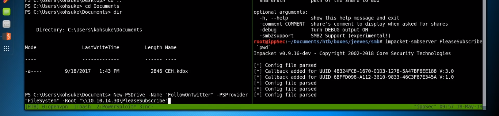

# Pentester

- Inicial
    
    [Enum Ports](Pentester/Enum_Ports.md)
    
    [Scaning](Pentester/Scaning.md)
    
- Services
    
    [FTP](Pentester/FTP.md)
    
    [SSH](Pentester/SSH.md)
    
    [HTTP ](Pentester/HTTP.md)
    
    [Web](Pentester/Web.md)
    
    [SMTP](Pentester/SMTP.md)
    
    [SNMP](Pentester/SNMP.md)
    
    [MSSQL](Pentester/MSSQL.md)
    
    [MYSQL](Pentester/MYSQL.md)
    
    [LDAP](Pentester/LDAP.md)
    
    [MDB-SQL](Pentester/MDB-SQL.md)
    
    [PSQL](Pentester/PSQL.md)
    
- Search in linux
    
    [Expressões Uteis](Pentester/Expresso%CC%83es%20Uteis.md)
    

- Sistemas Operativos
    
    [Linux](Pentester/Linux.md)
    
    [Windows](Pentester/Windows.md)
    
- Shell
    
    [Melhorar Shell](Pentester/Melhorar%20Shell.md)
    
    [Reverse Shell](Pentester/Reverse_Shell.md)
    
- Other
    
    [Mandar Ficheiros Windows](Pentester/Send_Files_Windows.md)
    
    [WI-FI](Pentester/WI-FI.md)
    
    [Git Repository](Pentester/Git_Repository.md)
    
    [DNS Loockup](Pentester/DNS.md)
    
- Enum Total
    
    [Enum](Pentester/Enum.md)
    

[BufferOverflow](Pentester/BufferOverflow.md)

[Creat Passwords](Pentester/Creat%20Passwords.md)

[Chisel- PortFoward](Pentester/Chisel_PortFoward.md)

Criar ficheiro com os bytes diferente `php → jpg`

```
└──╼ [★]$ head -c 20 /var/lib/inetsim/http/fakefiles/sample.jpg > teste
┌─[eu-dedivip-2]─[10.10.14.89]─[paulinho13@htb-nn8fi0k9bi]─[~]
└──╼ [★]$ mv teste jpg-magicbytes
┌─[eu-dedivip-2]─[10.10.14.89]─[paulinho13@htb-nn8fi0k9bi]─[~]
└──╼ [★]$ cat jpg-magicbytes jpg-magicbytes > magic-shell.php
┌─[eu-dedivip-2]─[10.10.14.89]─[paulinho13@htb-nn8fi0k9bi]─[~]
└──╼ [★]$ file magic-shell.php 
magic-shell.php: JPEG image data, JFIF standard 1.01, resolution (DPI), density 72x72, segment length 16
┌─[eu-dedivip-2]─[10.10.14.89]─[paulinho13@htb-nn8fi0k9bi]─[~]
```


